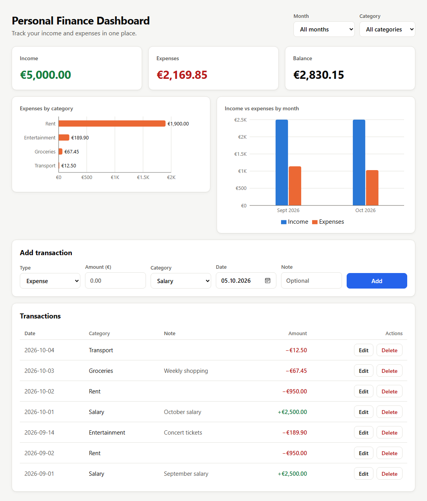

# Personal Finance Dashboard

**[Live demo →](https://advxnced25.github.io/personal-finance-dashboard/)**

A web app for tracking personal income and expenses: add transactions, filter them by month and category, and see totals and charts update instantly. Built with React and TypeScript, with a focus on correct money handling and tested business logic.

<picture>
  <source media="(prefers-color-scheme: dark)" srcset="docs/screenshots/dashboard-dark.png">
  
</picture>

## Features

- **Transactions** — add, edit and delete income and expenses (with a confirmation before deleting)
- **Summary** — income, expenses and balance for the selected period
- **Filters** — by month and category; totals and charts follow the filters
- **Charts** — expenses by category and income vs expenses by month
- **Persistence** — data is saved in the browser (`localStorage`) and survives page reloads
- **Responsive** — works on desktop and phone, in light and dark mode

## Engineering decisions

| Decision | Why |
|---|---|
| Money is stored as **integer cents** (`€12.50` → `1250`) | Floating point math is inexact (`0.1 + 0.2 !== 0.3`). User input is parsed into cents as text, without any float multiplication. |
| Every transaction has a **`currency` field** | Ready for multiple currencies. Totals are calculated per currency — amounts in different currencies are never added together. |
| Totals, filtered lists and chart data are **derived, not stored** | Only the transaction list lives in state; everything else is recalculated from it, so totals can never get out of sync. |
| Business logic lives in **pure functions** outside components | Easy to reason about and to test. Components only display data. |
| Dates are **ISO strings** (`YYYY-MM-DD`) | Sort correctly as plain text and serialize to JSON without loss. |
| Storage key is **versioned** (`pfd-transactions-v1`) and reads are defensive | Corrupted data or blocked storage never crashes the app; the format can evolve later. |
| **Accessibility** | Text colors pass WCAG 4.5:1 contrast, chart colors are checked for color-blind safety, visible focus for keyboard users. |

## Tech stack

- [React 19](https://react.dev) + [TypeScript](https://www.typescriptlang.org)
- [Vite](https://vite.dev) — dev server and build
- [Recharts](https://recharts.org) — charts
- [Vitest](https://vitest.dev) — unit tests
- [Oxlint](https://oxc.rs) — linting
- Plain CSS with design tokens (CSS custom properties) for light and dark themes

## Getting started

Requires [Node.js](https://nodejs.org) 22.12 or newer.

```bash
npm install      # install dependencies
npm run dev      # start the dev server at http://localhost:5173
```

| Command | What it does |
|---|---|
| `npm run dev` | Start the development server |
| `npm test` | Run all unit tests once |
| `npm run test:watch` | Re-run tests on every file change |
| `npm run build` | Type-check and build for production into `dist/` |
| `npm run lint` | Check the code with the linter |

## Tests

47 unit tests cover the business logic: money parsing and formatting (including a round-trip check for every amount from €0.01 to €1,000.00), summary totals, sorting and filtering, chart data and storage error handling.

```bash
npm test
```

## Project structure

```
src/
├── components/           UI components (form, table, filters, cards, charts)
├── App.tsx               App state and wiring between components
├── types.ts              Transaction and Currency types
├── money.ts              Parsing and formatting money (cents ↔ text)
├── summary.ts            Income, expenses and balance
├── filters.ts            Sorting and filtering by month and category
├── chartData.ts          Data preparation for charts
├── storage.ts            Saving to and loading from localStorage
├── categories.ts         The list of categories
└── *.test.ts             Unit tests next to the code they test
```

## Roadmap

- Backend with a database and user accounts, so data syncs across devices
- Monthly budgets per category
- Import of bank statements (CSV)
- Multiple currencies with exchange rates
